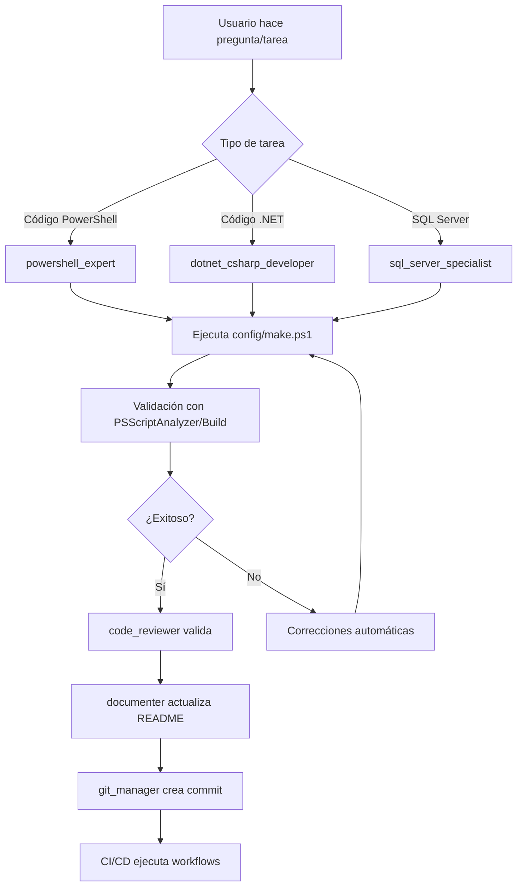

# Orquestación de Agentes de Inteligencia Artificial

Este directorio contiene la estructura de orquestación de agentes de IA para el proyectodel repositorio actual.

## Arquitectura Multi-Agente

La arquitectura implementada permite la colaboración entre diferentes agentes de IA, cada uno con habilidades especializadas, para automatizar y mejorar el desarrollo, mantenimiento y despliegue del sistema.

```
Usuario/Prompt
       │
       ▼
┌─────────────────────────────────────┐
│  Agentes AI Soportados              │
│  • Google Gemini/Antigravity        │
│  • GitHub Copilot                   │
│  • OpenCode                         │
└─────────────────────────────────────┘
       │
       ▼
┌─────────────────────────────────────┐
│  .agent/ (Este directorio)          │
│  ├── skills/                        │
│  └── rules/                         │
└─────────────────────────────────────┘
       │
       ▼
┌─────────────────────────────────────┐
│  config/make.ps1                    │
│  (Orquestador Central)              │
└─────────────────────────────────────┘
       │
       ▼
┌─────────────────────────────────────┐
│  GitHub Actions / VS Code Tasks     │
└─────────────────────────────────────┘
```

## Componentes Principales

### 📁 skills/

Contiene definiciones de agentes especializados con habilidades específicas:

- **powershell_expert.md** - Experto en desarrollo y análisis de código PowerShell
- **dotnet_csharp_developer.md** - Desarrollador especializado en .NET y C#
- **sql_server_specialist.md** - Especialista en bases de datos SQL Server
- **ci_cd_engineer.md** - Ingeniero de integración y despliegue continuo
- **docker_engineer.md** - Experto en contenedores y DevContainers
- **git_manager.md** - Gestor de control de versiones y flujos de trabajo
- **code_reviewer.md** - Revisor de código y calidad
- **documenter.md** - Especialista en documentación técnica
- **release_manager.md** - Gestor de versiones y releases
- **local_devops.md** - Operador de desarrollo local
- **community_manager.md** - Gestor de comunidad y contribuciones

### 📁 rules/

Define reglas obligatorias que todos los agentes deben seguir:

- **spanish_only.md** - Política de idioma español para documentación
- **centralized_docs.md** - Centralización de documentación en README.md
- **security_first.md** - Prioridades de seguridad en desarrollo

## Compatibilidad con Plataformas de IA

### Google Gemini / Google Antigravity

Lee directamente este archivo (`/.agent/README.md`) y activa las habilidades específicas según la tarea solicitada.

**Uso:** Los agentes de Google tienen acceso directo a la estructura de archivos y pueden cargar dinámicamente las habilidades necesarias.

### GitHub Copilot

Utiliza `.github/copilot-instructions.md` como puente de integración. Las instrucciones de Copilot referencian este directorio y ejecutan secuencias predefinidas a través de `config/make.ps1`.

**Uso:** Copilot carga las instrucciones base y las complementa con las habilidades específicas cuando es necesario.

### OpenCode

Sigue el estándar de orquestación basado en `AGENTS.md` en la raíz del proyecto.

**Uso:** OpenCode lee el archivo `AGENTS.md` que actúa como índice y referencia a esta estructura.

## Cómo Usar los Agentes

### Activación Automática

Los agentes se activan automáticamente según el contexto de la tarea:

- **Cambios en archivos `.ps1`** → `powershell_expert`
- **Cambios en archivos `.cs`, `.csproj`** → `dotnet_csharp_developer`
- **Cambios en archivos `.sql`, `.sqlproj`** → `sql_server_specialist`
- **Cambios en workflows CI/CD** → `ci_cd_engineer`
- **Cambios en Dockerfiles** → `docker_engineer`
- **Operaciones de Git** → `git_manager`
- **Pull Requests** → `code_reviewer`
- **Cambios en README.md** → `documenter`
- **Creación de tags/releases** → `release_manager`
- **Desarrollo local** → `local_devops`
- **Issues, discusiones** → `community_manager`

### Activación Manual

Puedes invocar específicamente un agente mencionando su nombre en tu prompt:

```
@powershell_expert: Analiza este script y sugiere mejoras
@sql_server_specialist: Optimiza esta consulta SQL
@documenter: Actualiza la documentación con los nuevos cambios
```

## Reglas de Coordinación

Todos los agentes siguen estas directrices:

1. **Idioma Español**: Toda la documentación y comunicación debe estar en español (ver `rules/spanish_only.md`)
2. **Documentación Centralizada**: Las actualizaciones se reflejan en `README.md` (ver `rules/centralized_docs.md`)
3. **Seguridad Primero**: Todas las modificaciones deben pasar validaciones de seguridad (ver `rules/security_first.md`)
4. **Orquestación Central**: Todas las tareas se ejecutan a través de `config/make.ps1`
5. **Validación Continua**: CI/CD debe pasar antes de cualquier merge

## Flujo de Trabajo Típico



## Extensión de Agentes

Para agregar nuevos agentes especializados:

1. Crear archivo `.md` en `skills/` con el nombre del agente
2. Definir las capacidades, herramientas y comandos específicos
3. Actualizar este README.md con la nueva entrada
4. Referenciar en `.github/copilot-instructions.md` si es necesario

## Mantenimiento

- **Revisar reglas**: Periódicamente validar que las reglas en `rules/` estén actualizadas
- **Actualizar habilidades**: Incorporar nuevas capacidades a los agentes según evolucione el proyecto
- **Sincronizar documentación**: Mantener consistencia entre `.agent/`, `.github/copilot-instructions.md` y `AGENTS.md`

## Referencias

- [Copilot Instructions](../.github/copilot-instructions.md)
- [OpenCode Agents](../AGENTS.md)
- [Build System](../config/make.ps1)
- [Workflows CI/CD](../.github/workflows/)

---

**Última actualización**: 2026-01-21  
**Versión**: 1.0  
**Mantenido por**: [Christian Grimberg](https://github.com/ChristianGrimberg)
